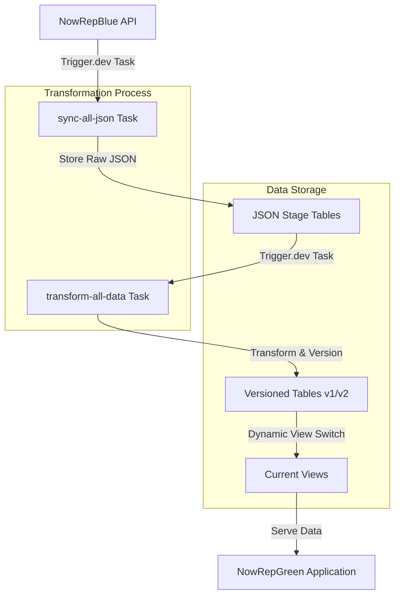
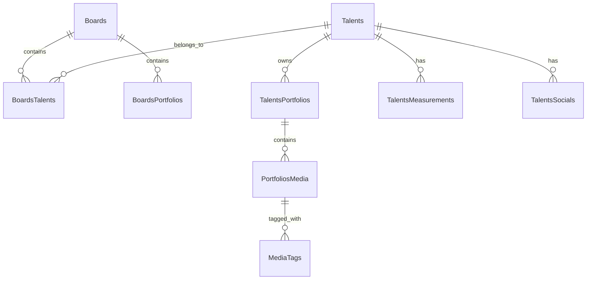

# NowRepGreen - Agency Portfolio Platform

A modern web application for agencies to showcase their talents and portfolios to potential clients.

## Overview

NowRepGreen is part of the NowRep suite, focusing specifically on the public-facing portfolio platform. While NowRepBlue handles the administrative and management aspects, NowRepGreen provides a beautiful, performant interface for:

- Agency profile and branding
- Talent portfolios and profiles
- Media galleries and showreels
- Portfolio organization and presentation

## Sample Portfolio Site

The repository includes a fully functional modeling agency portfolio site that demonstrates the capabilities of the NowRep suite:

### Key Features

- **Interactive Homepage**: Dynamic board navigation with hover effects and smooth transitions
- **Talent Directory**: Searchable talent listings organized by board categories
- **Board Pages**: Curated collections of talents with portfolio previews
- **Talent Profiles**: Detailed talent information with measurements, social links, and media galleries
- **Responsive Design**: Optimized for all device sizes with tailored layouts

### User Experience Highlights

- **Animated Transitions**: Smooth page transitions and hover effects enhance the browsing experience
- **Intuitive Navigation**: Consistent sidebar menu and header navigation across all pages
- **Visual Focus**: Minimalist design puts the spotlight on talent imagery and portfolios
- **Performance Optimized**: Fast loading times with image preloading and efficient rendering

### Data Synchronization Showcase

The sample site demonstrates the data synchronization between NowRepBlue (admin system) and NowRepGreen (public site):

- Changes made in the admin system can be pushed automatically, on a schedule, or manually based on the configuration of the data sync job
- Zero-downtime updates through the versioned table architecture
- Consistent data presentation across all views

## Technical Architecture

### Tech Stack

- **Framework**: React Router with TypeScript
- **Styling**: TailwindCSS
- **Database**: Prisma ORM with SQLite
- **Testing**: Vitest with React Testing Library
- **Code Quality**: ESLint, Prettier, TypeScript
- **Data sync**: Trigger.dev

### Deployment

For detailed deployment instructions and environment setup, see the [Deployment Strategy](docs/deployment-strategy.md) documentation.

## Data Pipeline Synchronization Architecture

The platform implements a sophisticated data synchronization system designed for reliability and zero-downtime updates:



### Sync Process Flow

1. **JSON Data Collection**

   - Trigger.dev task fetches data from multiple endpoints on a schedule or via manual trigger
   - Data is stored in JSON stage tables (e.g., `BoardsJson`, `TalentsJson`)
   - Each sync maintains last 3 versions for rollback capability

2. **Data Transformation**

   - Raw JSON data is transformed into normalized relational structure
   - Handles complex relationships (e.g., Boards-Talents, Talents-Portfolios)
   - Maintains data integrity through foreign key relationships

3. **Version Management**
   - Each entity type maintains two versioned tables (v1, v2)
   - Active version alternates between v1 and v2
   - Current views automatically point to active version
   - Zero-downtime updates through atomic view switching

### Entity Relationships



## Development

```bash
# Install dependencies
npm install

# Start development server
npm run dev

# Run tests
npm run test

# Run linting
npm run lint

# Format code
npm run format
```

Your application will be available at `http://localhost:5173`.

## Testing Strategy

The project follows a comprehensive testing approach:

1. **Unit Tests**: Core business logic and utility functions
2. **Integration Tests**: User flows and feature interactions
3. **E2E Tests**: Critical user journeys (not implemented yet)

Run the test suite with coverage reporting:

```bash
npm run test:coverage
```

## Database Setup

The application uses Prisma with SQLite, demonstrating:

- Advanced schema design with versioning
- Efficient indexing strategies
- Type-safe database queries

Set your `DATABASE_URL` in the environment variables before running migrations:

```bash
npx prisma migrate dev
npx prisma generate # Generate type-safe client
```

## Trigger.dev Setup

The application uses Trigger.dev for data synchronization. Create a free account on trigger.dev and configure the following environment variables:

```bash
# NowRepBlue instance is the source
SOURCE_API_URL=https://source.example.com
# This application is the target
TARGET_API_URL=https://target.example.com

# Trigger.dev Configuration
TRIGGER_API_KEY=your_trigger_dev_api_key
# Random secret set in both NowRepBlue and NowRepGreen
SYNC_SECRET_KEY=your_sync_secret_key
```

### Sync Tasks Configuration

The data synchronization is triggered through an API endpoint that NowRepBlue calls whenever relevant data changes occur:

1. **Orchestration Endpoint** (`/api/internal/orchestrate-sync`)
   ```typescript
   // Endpoint that receives sync triggers from NowRepBlue
   // Validates requests using SYNC_SECRET_KEY
   // Available via both GET and POST methods
   export async function action({ request }: ActionFunctionArgs) {
     validateSecretKey(request);
     return await tasks.trigger<typeof orchestrateSyncTask>(
       "orchestrate-sync",
       undefined,
       {},
     );
   }
   ```

The orchestrator then manages two main tasks:

1. **JSON Sync Task** (`sync-all-json`)

   ```typescript
   // Triggered by the orchestrator when source data changes
   export const syncAllJson = task({
     id: "sync-all-json",
     retry: {
       maxAttempts: 3,
       minTimeoutInMs: 1000,
       maxTimeoutInMs: 10000,
     },
   });
   ```

2. **Data Transform Task** (`transform-all-data`)
   ```typescript
   // Triggered after successful JSON sync
   export const transformAllData = task({
     id: "transform-all-data",
   });
   ```

### Task Monitoring

Monitor task execution through the Trigger.dev CLI:

```bash
npx @trigger.dev/cli@latest dev
```

Or access trigger.dev account online

## Code Quality

Maintain code quality by running:

```bash
npm run lint      # Check for code issues
npm run lint:fix  # Auto-fix code issues
npm run format    # Format code with Prettier
```

---

For administrative features and talent management, please refer to [NowRepBlue](link-to-nowrepblue).

## Architecture Diagram

```
├── src/
│   ├── components/     # Reusable UI components
│   ├── routes/        # React Router route components
│   ├── lib/           # Core business logic
│   ├── utils/         # Utility functions
│   ├── hooks/         # Custom React hooks
│   ├── types/         # TypeScript type definitions
│   └── tests/         # Test suites
```
