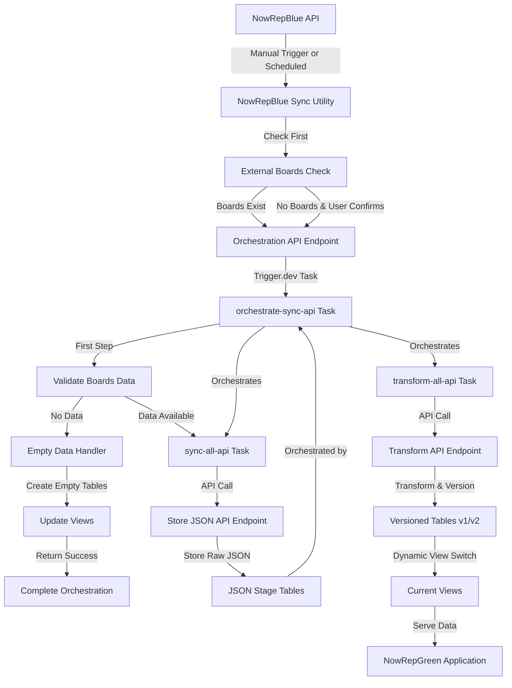
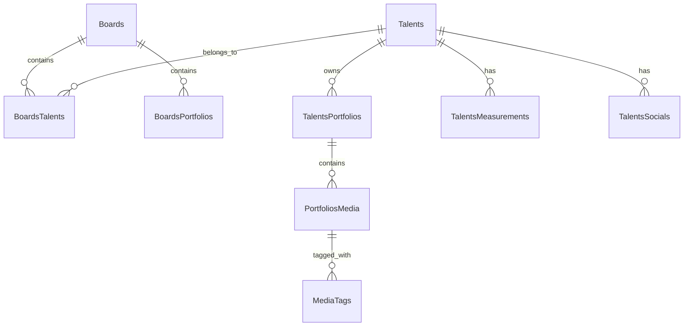

# NowRepGreen - Agency Portfolio Platform

A modern web application for agencies to showcase their talents and portfolios to potential clients.

## Overview

NowRepGreen is part of the NowRep suite, focusing specifically on the public-facing portfolio platform. While NowRepBlue handles the administrative and management aspects, NowRepGreen provides a beautiful, performant interface for:

- Agency profile and branding
- Talent portfolios and profiles
- Media galleries and showreels
- Portfolio organization and presentation

## Sample Portfolio Site

The repository includes a fully functional modeling agency portfolio site that demonstrates the capabilities of the NowRep suite:

### Key Features

- **Interactive Homepage**: Dynamic board navigation with hover effects and smooth transitions
- **Talent Directory**: Searchable talent listings organized by board categories
- **Board Pages**: Curated collections of talents with portfolio previews
- **Talent Profiles**: Detailed talent information with measurements, social links, and media galleries
- **Responsive Design**: Optimized for all device sizes with tailored layouts

### User Experience Highlights

- **Animated Transitions**: Smooth page transitions and hover effects enhance the browsing experience
- **Intuitive Navigation**: Consistent sidebar menu and header navigation across all pages
- **Visual Focus**: Minimalist design puts the spotlight on talent imagery and portfolios
- **Performance Optimized**: Fast loading times with image preloading and efficient rendering

### Data Synchronization Showcase

The sample site demonstrates the data synchronization between NowRepBlue (admin system) and NowRepGreen (public site):

- Changes made in the admin system can be pushed on a schedule or manually based on the configuration of the data sync job
- Zero-downtime updates through the versioned table architecture
- Consistent data presentation across all views

## Technical Architecture

### Tech Stack

- **Framework**: React Router with TypeScript
- **Styling**: TailwindCSS
- **Database**: Prisma ORM with SQLite
- **Testing**: Vitest with React Testing Library
- **Code Quality**: ESLint, Prettier, TypeScript
- **Data sync**: Trigger.dev

### Deployment

For detailed deployment instructions and environment setup, see the [Deployment Strategy](docs/deployment-strategy.md) documentation.

## Data Pipeline Synchronization Architecture

The platform implements an API-driven data synchronization system designed for reliability and zero-downtime updates:



### Sync Process Flow

1. **Validation**

   - Before initiating sync, NowRepBlue checks for the existence of external boards
   - If no external boards exist, a warning dialog informs users that proceeding will empty the portfolio site
   - Users can choose to cancel or proceed with the sync operation
   - On the NowRepGreen side, the orchestration process validates if boards data is available
   - If no data is available, the system creates empty tables and updates views accordingly

2. **Orchestration**

   - NowRepBlue can trigger the sync process manually through a user-friendly interface
   - The orchestration task coordinates both sync and transform operations
   - API-driven approach ensures compatibility with Trigger.dev cloud environment

3. **JSON Data Collection**

   - Sync task fetches data from NowRepBlue API endpoints
   - Data is stored via API calls to JSON stage tables (e.g., `BoardsJson`, `TalentsJson`)
   - Each sync maintains last 3 versions for rollback capability

4. **Data Transformation**

   - Raw JSON data is transformed into normalized relational structure via API calls
   - Handles complex relationships (e.g., Boards-Talents, Talents-Portfolios)
   - Maintains data integrity through foreign key relationships

5. **Version Management**
   - Each entity type maintains two versioned tables (v1, v2)
   - Active version alternates between v1 and v2
   - Current views automatically point to active version
   - Zero-downtime updates through atomic view switching
   - Empty data scenarios are handled gracefully with empty tables and updated views

### Entity Relationships



## Development

```bash
# Install dependencies
npm install

# Start development server
npm run dev

# Run tests
npm run test

# Run linting
npm run lint

# Format code
npm run format
```

Your application will be available at `http://localhost:5173`.

## Testing Strategy

The project follows a comprehensive testing approach:

1. **Unit Tests**: Core business logic and utility functions
2. **Integration Tests**: User flows and feature interactions
3. **E2E Tests**: Critical user journeys (not implemented yet)

Run the test suite with coverage reporting:

```bash
npm run test:coverage
```

## Database Setup

The application uses Prisma with SQLite, demonstrating:

- Advanced schema design with versioning
- Efficient indexing strategies
- Type-safe database queries

Set your `DATABASE_URL` in the environment variables before running migrations:

```bash
npx prisma migrate dev
npx prisma generate # Generate type-safe client
```

## Trigger.dev Setup

The application uses Trigger.dev for data synchronization. Create a free account on trigger.dev and configure the following environment variables:

```bash
# NowRepBlue instance is the source
SOURCE_API_URL=https://source.example.com
# This application is the target
TARGET_API_URL=https://target.example.com

# Trigger.dev Configuration
TRIGGER_API_KEY=your_trigger_dev_api_key
# Random secret set in both NowRepBlue and NowRepGreen
SYNC_SECRET_KEY=your_sync_secret_key
```

### API Endpoints for Synchronization

The data synchronization is managed through several API endpoints:

1. **Orchestration Endpoint** (`/api/internal/orchestrate-sync-api`)

   - Receives sync triggers from NowRepBlue
   - Validates requests using SYNC_SECRET_KEY
   - Supports both `Authorization: Bearer` and `x-sync-secret` headers
   - Returns task ID for monitoring

2. **Store JSON Endpoint** (`/api/internal/sync/store-json`)

   - Accepts entity name and JSON data
   - Stores data in the appropriate JSON table
   - Handles cleanup of old records (keeping only 3 most recent)

3. **Transform Endpoint** (`/api/internal/transform/:entity`)

   - Transforms JSON data for a specific entity
   - Updates versioned tables and views

4. **Task Status Endpoint** (`/api/internal/task-status/:taskId`)
   - Retrieves status of specific tasks or lists multiple tasks
   - Supports filtering by task type, status, and limit

5. **Empty Data Handler Endpoint** (`/api/internal/empty-data-handler`)
   - Creates empty tables for all entities when no data is available
   - Updates views to point to these empty tables
   - Ensures the application continues to function with empty data sets
   - Returns detailed information about processed entities

### Trigger.dev Tasks

The synchronization process is managed by three main tasks:

1. **Orchestration Task** (`orchestrate-sync-api`)

   ```typescript
   // Coordinates the execution of sync and transform tasks
   export const orchestrateSyncApi = task({
     id: "orchestrate-sync-api",
   });
   ```
   - Includes data validation before proceeding with sync
   - Handles empty data scenarios by creating empty tables
   - Provides comprehensive error handling and reporting

2. **API-Driven Sync Task** (`sync-all-api`)

   ```typescript
   // Fetches data from NowRepBlue API and stores via API calls
   export const syncAllApi = task({
     id: "sync-all-api",
   });
   ```

3. **API-Driven Transform Task** (`transform-all-api`)
   ```typescript
   // Transforms data via API calls
   export const transformAllDataApi = task({
     id: "transform-all-data-api",
   });
   ```

### Data Validation Utilities

The system includes dedicated utilities for data validation:

```typescript
// Validates if the boards API endpoint returns data
export async function validateBoardsData(): Promise<{
  hasData: boolean;
  message: string;
}> {
  // Implementation details...
}

// Handles empty data scenarios
export async function handleEmptyDataScenario(): Promise<{
  success: boolean;
  message: string;
  entities: string[];
}> {
  // Implementation details...
}
```

### Task Monitoring

Monitor task execution through the Trigger.dev CLI:

```bash
npx @trigger.dev/cli@latest dev
```

Or access the trigger.dev dashboard online.

## Code Quality

Maintain code quality by running:

```bash
npm run lint      # Check for code issues
npm run lint:fix  # Auto-fix code issues
npm run format    # Format code with Prettier
```

---

For administrative features and talent management, please refer to [NowRepBlue](link-to-nowrepblue).

## Architecture Diagram

```
├── src/
│   ├── components/     # Reusable UI components
│   ├── routes/        # React Router route components
│   ├── lib/           # Core business logic
│   ├── utils/         # Utility functions
│   ├── hooks/         # Custom React hooks
│   ├── types/         # TypeScript type definitions
│   └── tests/         # Test suites
```
