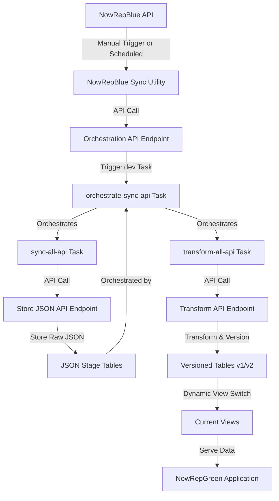
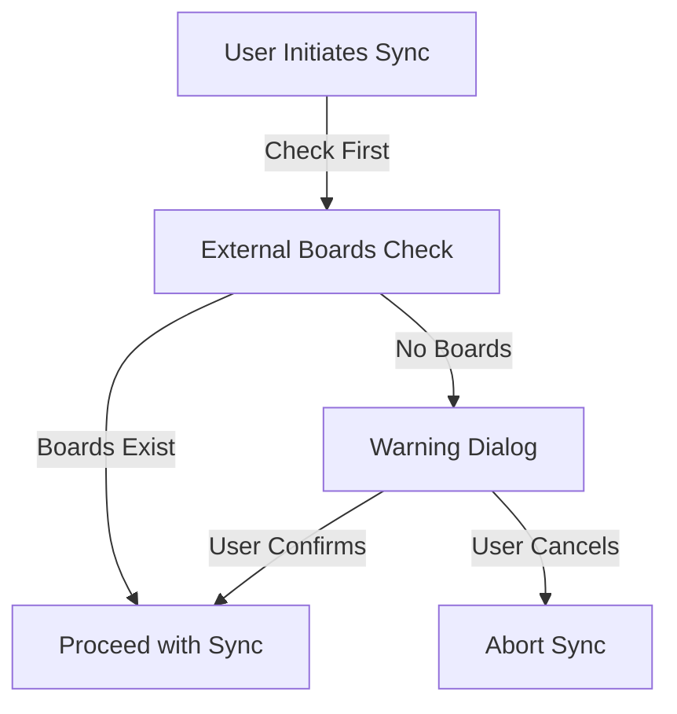
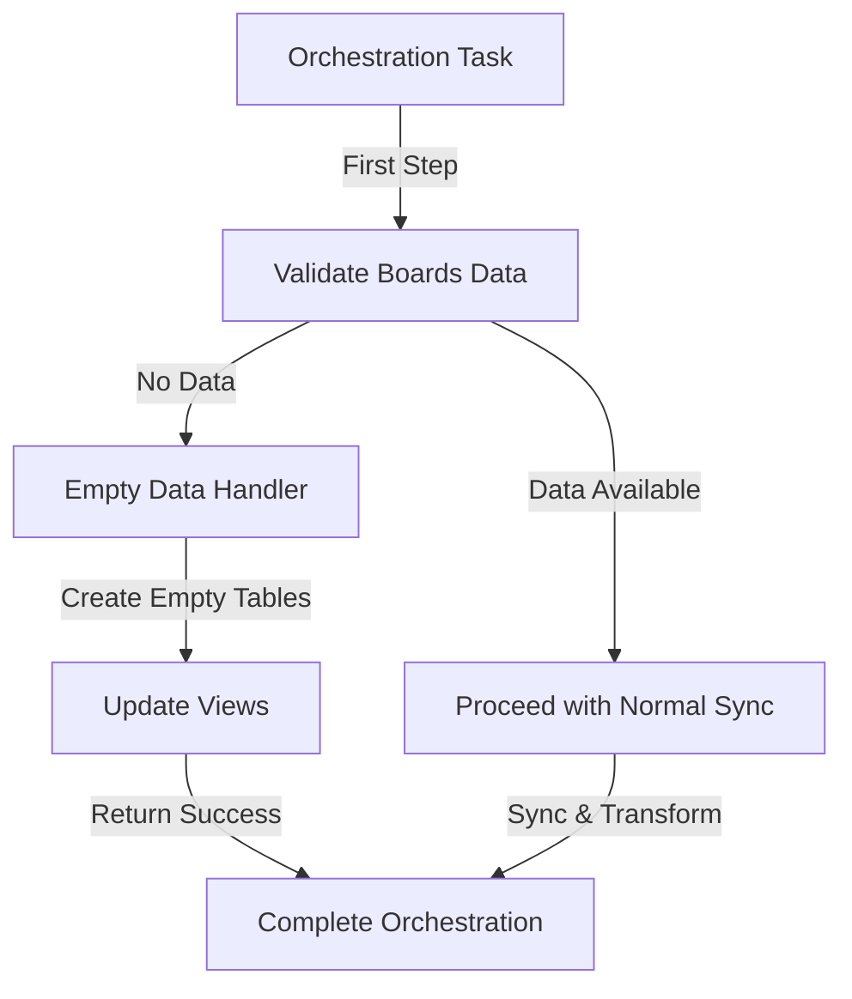
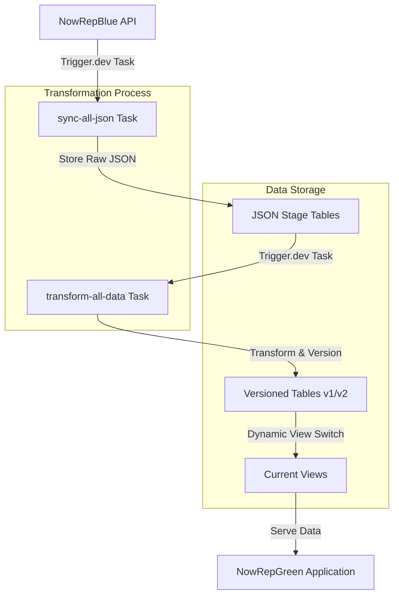
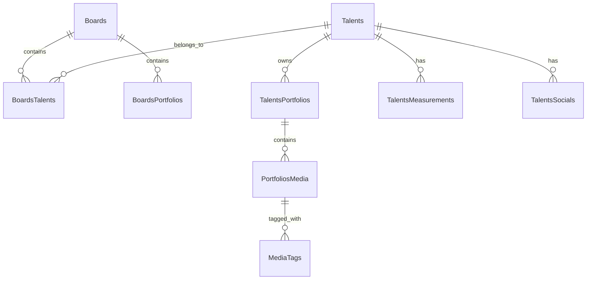

# Data Synchronization: NowRepBlue → NowRepGreen

## Refactored Architecture: API-Driven Synchronization

### Problem Statement

The original synchronization architecture relied on direct database access from trigger.dev tasks. This approach encountered issues in the trigger.dev cloud environment where:

1. SQLite database files couldn't be accessed or created at the expected path (`file:/data/sqlite.db`)
2. Error messages indicated "Error code 14: Unable to open the database file"
3. While the approach works in local development, it fails in the cloud environment

### Solution: API-Driven Synchronization

To address these limitations, we've implemented an API-driven approach that decouples trigger.dev tasks from direct database operations:



#### Key Benefits

- Trigger.dev tasks no longer require direct database access
- Database operations occur in the main application where SQLite is properly configured
- Improved separation of concerns between orchestration and data processing
- Maintains compatibility with both local and cloud environments
- Enables manual triggering from the source application (NowRepBlue)

### Data Validation Process

To ensure data integrity and prevent unintended consequences during synchronization, we've implemented a comprehensive validation process:

#### 1. Source-Side Validation (NowRepBlue)

Before initiating a sync operation, the system performs a critical check for external boards:



1. **External Board Check**:
   - The system queries the database for boards with "EXTERNAL" visibility
   - This check is performed via a dedicated API endpoint (`/api/internal/check-external-boards`)
   - Requires user authentication for security

2. **Warning Dialog**:
   - If no external boards exist, a warning dialog appears explaining the consequences
   - Informs users that proceeding will empty the portfolio site
   - Provides clear options: "Cancel" or "Yes, Proceed"

3. **User Decision Flow**:
   - If the user cancels, the sync operation is aborted
   - If the user confirms, the sync proceeds despite the absence of external boards
   - If external boards exist, the sync proceeds automatically without warning

#### 2. Target-Side Validation (NowRepGreen)

The orchestration process includes a validation step to handle empty data scenarios gracefully:



1. **Boards Data Validation**:
   - The orchestration task first checks if the boards API endpoint returns data
   - This serves as an "anchor check" before proceeding with the full sync

2. **Empty Data Handler**:
   - If no data is available, a dedicated endpoint (`/api/internal/empty-data-handler`) is called
   - This handler creates empty tables for all entities
   - Updates views to point to these empty tables
   - Ensures the application continues to function with empty data sets

3. **Graceful Degradation**:
   - Instead of failing, the system creates appropriate empty structures
   - Maintains application functionality even with no data
   - Provides detailed logging about the empty data scenario

This dual validation approach (both at source and target) ensures that:
1. Users are fully informed before emptying the portfolio site
2. The system handles empty data scenarios gracefully
3. The synchronization process is robust against data availability issues

### Implementation Guide

#### 1. Server-Side API Endpoints

Three new API endpoints in the main application:

1. **Store JSON Endpoint** (`/api/internal/sync/store-json`):

   - Accepts entity name and JSON data
   - Stores data in the appropriate `{entity}_json` table
   - Handles cleanup of old records (keeping only the 3 most recent)
   - Secured with `SYNC_SECRET_KEY`

2. **Transform Endpoint** (`/api/internal/transform/:entity`):

   - Accepts entity name to transform
   - Executes the appropriate transformation logic
   - Returns success/failure status and version information
   - Secured with `SYNC_SECRET_KEY`

3. **Orchestration Endpoint** (`/api/internal/orchestrate-sync-api`):

   - Triggers the orchestration task in trigger.dev
   - Returns task ID for monitoring
   - Secured with `SYNC_SECRET_KEY`
   - Supports both `Authorization: Bearer` and `x-sync-secret` headers

4. **Task Status Endpoint** (`/api/internal/task-status/:taskId`):
   - Retrieves status of a specific task or lists multiple tasks
   - Supports filtering by task type, status, and limit
   - Secured with `SYNC_SECRET_KEY`
   - Enables monitoring of task progress

5. **Empty Data Handler Endpoint** (`/api/internal/empty-data-handler`):
   - Creates empty tables for all entities when no data is available
   - Updates views to point to these empty tables
   - Secured with `SYNC_SECRET_KEY`
   - Returns detailed information about processed entities

#### 2. Refactored Trigger.dev Tasks

Three trigger.dev tasks that use API calls instead of direct database access:

1. **API-Driven Sync Task** (`sync-all-api.ts`):

   - Fetches data from NowRepBlue API endpoints
   - Calls the Store JSON API endpoint instead of using Prisma directly
   - Maintains the same orchestration flow
   - Configures `keepCount: 3` to retain only 3 most recent records

2. **API-Driven Transform Task** (`transform-all-api.ts`):

   - Calls the Transform API endpoint for each entity
   - Maintains the same dependency order for transformations
   - Handles errors and reporting

3. **Orchestration Task** (`orchestrate-sync-api.ts`):
   - Coordinates the execution of sync and transform tasks
   - Ensures sync completes successfully before starting transform
   - Provides comprehensive error handling and reporting
   - Returns detailed results including success status and timing information

#### 3. Source Application (NowRepBlue) Integration

The source application includes a user-friendly interface for manually triggering and monitoring the sync process:

1. **UI Components**:

   - Sync dropdown button in the application header
   - Last sync timestamp display
   - Manual sync trigger button
   - Visual feedback during sync operations
   - Warning dialog for empty data scenarios

2. **Server-Side Utilities**:

   - `hasExternalBoards()`: Checks if any boards with "EXTERNAL" visibility exist
     - Queries the database directly for efficiency
     - Returns a boolean indicating whether external boards exist
     - Used as a pre-sync validation check

   - `triggerAndMonitorSync`: Handles the complete sync workflow
     - Initiates sync via the orchestration endpoint
     - Polls for task status until completion
     - Records timestamps for each status check
     - Returns comprehensive results including success status and timing data

   - Supporting functions for triggering sync and checking task status
   - Retrieves historical task information including last successful run

3. **Process Flow**:
   - User triggers sync manually via the header dropdown
   - System checks for external boards before proceeding
   - If no external boards exist, a warning dialog appears
   - User decides whether to proceed or cancel
   - If proceeding, system initiates the sync process and provides visual feedback
   - Application polls the target system to monitor progress
   - Upon completion, the UI updates with the new sync timestamp
   - Detailed error information is available in case of failures

#### 4. Security Considerations

- Authentication via `SYNC_SECRET_KEY` for all API endpoints
- Support for both `Authorization: Bearer` and `x-sync-secret` header formats
- Validation of input data before processing
- Detailed error logging without exposing sensitive information
- Environment variable validation in trigger.dev tasks

#### 5. Empty Data Handling

The system includes a robust mechanism for handling empty data scenarios:

1. **Source-Side Prevention**:
   - Before initiating sync, NowRepBlue checks for external boards
   - If none exist, users are warned that proceeding will empty the portfolio site
   - This proactive approach prevents unintended data loss

2. **Target-Side Graceful Degradation**:
   - If the boards API returns no data, the orchestration process detects this
   - Instead of failing, it calls the empty data handler endpoint
   - The handler creates empty tables for all entities and updates views
   - This ensures the application continues to function with empty data sets

3. **Implementation Details**:
   ```typescript
   // In orchestrate-sync-api.ts
   if (!validationResult.hasData) {
     console.warn("No boards data available from source API:", validationResult.message);
     console.log("Proceeding with empty data handling...");

     // Handle empty data scenario by creating empty tables
     const emptyDataResult = await handleEmptyDataScenario();

     // Return success with empty data handling information
     return {
       success: true,
       stage: "empty_data_handling",
       message: "Successfully created empty tables due to no source data",
       validationResult,
       emptyDataResult,
       completedAt: new Date().toISOString(),
     };
   }
   ```

4. **Benefits**:
   - Prevents sync failures due to empty data
   - Maintains application functionality even with no data
   - Provides clear feedback about the empty data scenario
   - Allows for easy recovery when data becomes available again

### Configuration Requirements

For the sync process to work correctly, the following environment variables must be set:

1. **In NowRepGreen (Target Application)**:

   - `SYNC_SECRET_KEY`: Secret key for authenticating sync requests
   - `DATABASE_URL`: Path to the SQLite database

2. **In Trigger.dev**:

   - `SYNC_SECRET_KEY`: Same secret key as in NowRepGreen
   - `TARGET_API_URL`: URL of the NowRepGreen application
   - `SOURCE_API_URL`: URL of the NowRepBlue API

3. **In NowRepBlue (Source Application)**:
   - `SYNC_SECRET_KEY`: Same secret key as in NowRepGreen
   - `TARGET_API_URL`: Comma-separated list of NowRepGreen URLs to try

### Monitoring and Troubleshooting

1. **Task Status Endpoint**:

   - Check the status of specific tasks: `/api/internal/task-status/{taskId}`
   - List recent tasks: `/api/internal/task-status/all`
   - Filter by task type: `/api/internal/task-status/all?type=orchestrate-sync-api`

2. **Trigger.dev Dashboard**:

   - Monitor task execution and logs
   - View detailed error information
   - Access via `npx @trigger.dev/cli@latest dev` or online dashboard

3. **Application Logs**:
   - Detailed logging throughout the sync process
   - Timestamps for each step
   - Error details for troubleshooting

# Initial Implementation of data sync process

## System Overview

NowRepGreen maintains a local copy of NowRepBlue data through an event-driven synchronization system, transforming JSON API responses into normalized relational data. The system is designed for reliability, zero-downtime updates, and automatic recovery.

## Architecture

### 1. Data Flow



### 2. Entity Relationships



### 3. Components

- **API Endpoint** (`/api/internal/orchestrate-sync`): Receives sync triggers from NowRepBlue
- **Sync Task**: Fetches and stores raw JSON from all API endpoints
- **Transform Task**: Converts JSON to normalized relational structure
- **Version Manager**: Maintains table versions and views
- **Cleanup Process**: Removes outdated versions

### 4. Database Structure

#### Storage Tables

- `{entity}_json`: Raw JSON storage (keeps last 3 versions)
- `{entity}_v{n}`: Normalized data tables (v1, v2)
- `{entity}_current`: Views pointing to active version
- `sync_metadata`: Tracks active and backup versions

### 5. Implementation Guide

#### A. Task Structure

1. **Orchestration Endpoint** (`/api/internal/orchestrate-sync`):

   ```typescript
   export async function action({ request }: ActionFunctionArgs) {
     validateSecretKey(request);
     return await tasks.trigger<typeof orchestrateSyncTask>(
       "orchestrate-sync",
       undefined,
       {},
     );
   }
   ```

2. **JSON Sync Task** (`sync-all-json`):

   ```typescript
   export const syncAllJson = task({
     id: "sync-all-json",
     retry: {
       maxAttempts: 3,
       minTimeoutInMs: 1000,
       maxTimeoutInMs: 10000,
     },
   });
   ```

3. **Transform Task** (`transform-all-data`):
   ```typescript
   export const transformAllData = task({
     id: "transform-all-data",
   });
   ```

#### B. Version Management

1. Version Control:

   - Each entity maintains v1 and v2 tables
   - Active version alternates between v1 and v2
   - Current views automatically point to active version
   - Zero-downtime updates through atomic view switching

2. Version Tracking:
   ```typescript
   async function getNextVersion(entity: string) {
     const current = await prisma.syncMetadata.findFirst({
       where: { entityName: entity },
     });
     return {
       newVersion: current?.activeVersion === 1 ? 2 : 1,
       oldVersion: current?.activeVersion,
     };
   }
   ```

### 6. Transformation Order

1. Independent Entities:

   - Talents
   - Boards
   - MediaTags

2. Dependent Entities:

   - TalentsPortfolios
   - PortfoliosMedia
   - TalentsMeasurements
   - TalentsSocials

3. Junction Tables:
   - BoardsTalents
   - BoardsPortfolios
   - MediaTags_Junction

### 7. Error Handling

- Transaction-based atomic operations
- Retry mechanism for sync tasks
- Validation of sync secret key
- Granular error reporting per entity
- Automatic rollback capability

### 8. Security

- SYNC_SECRET_KEY validation for all sync triggers
- Environment-based configuration
- Secure API endpoints

### 9. Monitoring

Monitor sync process through:

```bash
npx @trigger.dev/cli@latest dev
```

Or access trigger.dev dashboard online

## Implementation Notes

- Using SQLite for data storage
- All media assets referenced via URLs
- Zero-downtime updates via view switching
- Type-safe transformations using TypeScript
- Automated cleanup of old JSON versions
