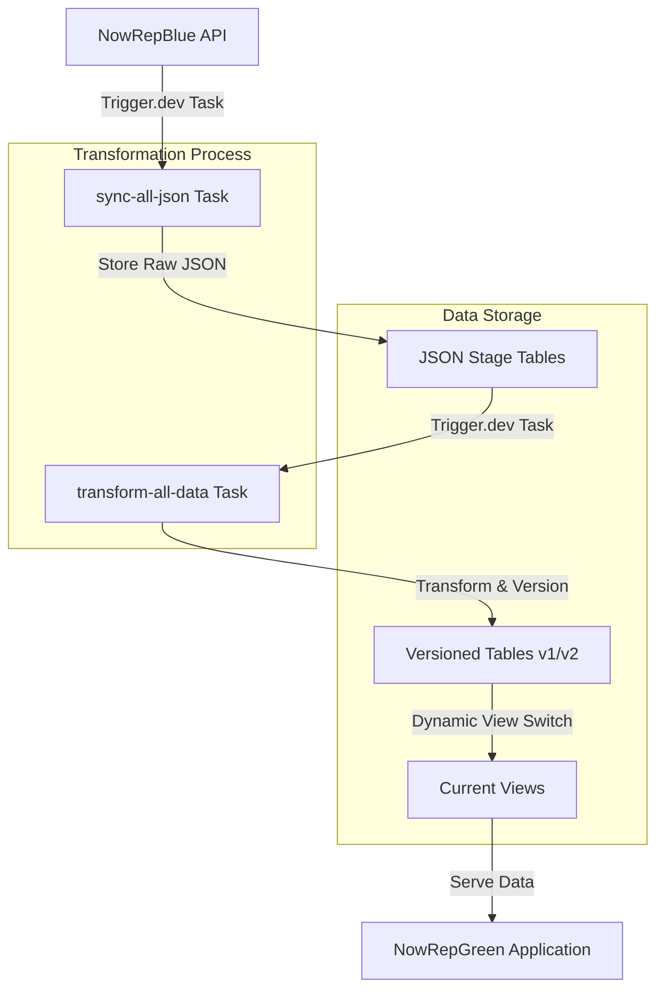
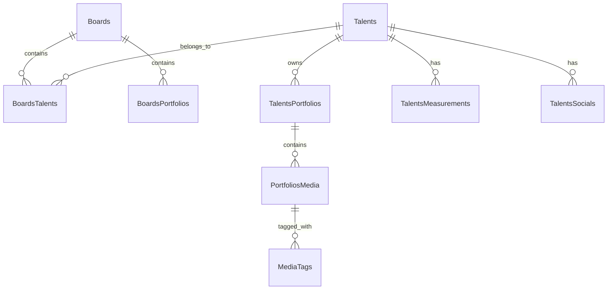

# Data Synchronization: NowRepBlue → NowRepGreen

## System Overview

NowRepGreen maintains a local copy of NowRepBlue data through an event-driven synchronization system, transforming JSON API responses into normalized relational data. The system is designed for reliability, zero-downtime updates, and automatic recovery.

## Architecture

### 1. Data Flow



### 2. Entity Relationships



### 3. Components

- **API Endpoint** (`/api/internal/orchestrate-sync`): Receives sync triggers from NowRepBlue
- **Sync Task**: Fetches and stores raw JSON from all API endpoints
- **Transform Task**: Converts JSON to normalized relational structure
- **Version Manager**: Maintains table versions and views
- **Cleanup Process**: Removes outdated versions

### 4. Database Structure

#### Storage Tables

- `{entity}_json`: Raw JSON storage (keeps last 3 versions)
- `{entity}_v{n}`: Normalized data tables (v1, v2)
- `{entity}_current`: Views pointing to active version
- `sync_metadata`: Tracks active and backup versions

### 5. Implementation Guide

#### A. Task Structure

1. **Orchestration Endpoint** (`/api/internal/orchestrate-sync`):

   ```typescript
   export async function action({ request }: ActionFunctionArgs) {
     validateSecretKey(request);
     return await tasks.trigger<typeof orchestrateSyncTask>(
       "orchestrate-sync",
       undefined,
       {},
     );
   }
   ```

2. **JSON Sync Task** (`sync-all-json`):

   ```typescript
   export const syncAllJson = task({
     id: "sync-all-json",
     retry: {
       maxAttempts: 3,
       minTimeoutInMs: 1000,
       maxTimeoutInMs: 10000,
     },
   });
   ```

3. **Transform Task** (`transform-all-data`):
   ```typescript
   export const transformAllData = task({
     id: "transform-all-data",
   });
   ```

#### B. Version Management

1. Version Control:

   - Each entity maintains v1 and v2 tables
   - Active version alternates between v1 and v2
   - Current views automatically point to active version
   - Zero-downtime updates through atomic view switching

2. Version Tracking:
   ```typescript
   async function getNextVersion(entity: string) {
     const current = await prisma.syncMetadata.findFirst({
       where: { entityName: entity },
     });
     return {
       newVersion: current?.activeVersion === 1 ? 2 : 1,
       oldVersion: current?.activeVersion,
     };
   }
   ```

### 6. Transformation Order

1. Independent Entities:

   - Talents
   - Boards
   - MediaTags

2. Dependent Entities:

   - TalentsPortfolios
   - PortfoliosMedia
   - TalentsMeasurements
   - TalentsSocials

3. Junction Tables:
   - BoardsTalents
   - BoardsPortfolios
   - MediaTags_Junction

### 7. Error Handling

- Transaction-based atomic operations
- Retry mechanism for sync tasks
- Validation of sync secret key
- Granular error reporting per entity
- Automatic rollback capability

### 8. Security

- SYNC_SECRET_KEY validation for all sync triggers
- Environment-based configuration
- Secure API endpoints

### 9. Monitoring

Monitor sync process through:

```bash
npx @trigger.dev/cli@latest dev
```

Or access trigger.dev dashboard online

## Implementation Notes

- Using SQLite for data storage
- All media assets referenced via URLs
- Zero-downtime updates via view switching
- Type-safe transformations using TypeScript
- Automated cleanup of old JSON versions
